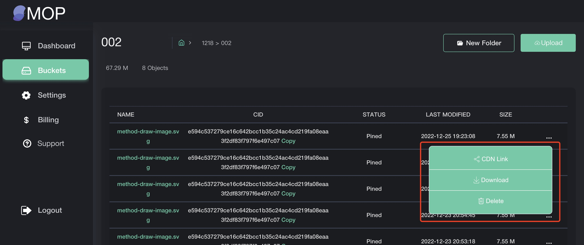

# MOP 用户操作手册

# 一、登录注册
1、首次未注册用户，登录即会注册；

2、按主界面输入请邮箱和密码，点击登录就完成登录，登录成功后跳转到Dashboard界面。首次未注册用户同时完成注册和登录；

# 二、Dashboard
## 1、链接钱包
1、使用钱包时，提前给操作系统浏览器安装好钱包matemask插件工具，分别在插件商店中完成安装使用；

2、点击链接钱包，会启动浏览器matemask钱包，输入用户钱包的账号密码，完成钱包账户登录，选择要连接登录的钱包账户地址，确认后MOP上显示已连接的钱包地址。

## 2、复制钱包地址

已连接钱包的情况，再次点击钱包地址，点击复制钱包地址，即已复制钱包地址到粘贴板。

## 3、断开钱包

已连接钱包的情况，再次点击钱包地址，点击断开即断开钱包连接。断开后不显示钱包地址。

## 4、存储概览

可以看到已创建的存储Bucket数量，已创建的存储文件Objects总数量，已使用的存储总容量，已购买的存储总容量；

## 5、数据概览

可以看到最近7天的每天使用存储容量的记录曲线，可以看到最近7天的每天下载流量的及录取线；

## 6、账户最近使用记录
可以看到登录账户邮箱、登录IP和登录时间。

# 三、使用存储Bucket
## 1、购买存储；

1.1 点击购买存储按钮，输入要购买存储的容量大小，提交购买。

1.2 提交购买后，会启动matemask钱包。如未登录钱包，需先登录钱包账户，成功登录钱包账户后，会显示购买存储的支付金额详情，如确认无误，点击确认，钱包正常完成支付后，会提醒支付成功。

1.3 MOP购买存储会提醒支付成功，存储容量会新增已购买的存储容量。

## 2、购买流量； 
1.1 点击购买流量按钮，输入要购买流量的容量大小，提交购买。

1.2 提交购买后，会启动matemask钱包。如未登录钱包，需先登录钱包账户，成功登录钱包账户后，会显示购买存储的支付金额详情，如确认无误，点击确认，钱包正常完成支付后，会提醒支付成功。

1.3 MOP购买流量会提醒支付成功，流量容量会新增已购买的流量容量。

## 3、创建Bucket
点击创建存储Bucket按钮，显示创建菜单，输入Bucket名称，默认MOP存储网络，选择存储区域，可选全球或中国，完成设置后提交完成创建。

## 4、创建文件夹
点击进入任意已创建的存储Bucket后，点击创建文件夹按钮，输入文件夹名称并提交完成文件夹创建。

## 5、单文件存储
点击上传按钮，显示上传菜单，选择文件存储按钮，弹出浮层选择要上传本地文件，选择后开始上传文件。

文件上传中会显示相应的上传状态（上传中、上链、完成上链），完成上传后并提醒上传成功。上传的数据会根据上链实际情况，变更文件状态，显示上链固定，完成上链。

## 6、文件夹的文件存储
点击上传按钮，显示上传菜单，选择文件夹存储按钮，弹出浮层选择要上传本地文件夹，选择后会提醒此文件夹包含的开始上传文件。

文件上传中会显示相应的上传状态（上传中、上链、完成上链），完成上传后并提醒上传成功。上传的数据会根据上链实际情况，变更文件状态，显示上链固定，完成上链。

## 7、文件的CID存储
点击上传按钮，显示上传菜单，选择CID存储按钮，弹出菜单输入文件名称和CID地址，点击提交完成CID文件存储。已存储的CID文件会从区块链存储上搜索此CID地址的文件，然后添加到文件列表内。

### 存储详情-更多-复制URL
文件上传存储成功后，点击此文件的更多按钮，选择CDN URL按钮，复制成功URL地址，可单独浏览器访问此文件CDN URL。

### 存储详情-更多-下载
文件上传存储成功后，点击此文件的更多按钮，选择下载按钮，即直接下载此文件到本地。

### 存储详情-更多-删除
文件上传存储成功后，点击此文件的更多按钮，选择删除按钮，即删除此存储文件。

# 四、设置Settings
## 1、设置名称；
点击设置菜单，输入设置的名称，点击保存即完成；

## 2、修改密码；
点击设置菜单，输入旧密码，再输入新的密码，再次输入确认的新密码，提交后完成修改密码。

# 五、账单Billing
## 1、存储账单；
点击菜单账单按钮，默认显示已购买存储的账单记录，显示已往的账单明细（购买时间，交易hash，交易金额，存储容量大小，交易状态），可查看此笔交易收据。

## 2、流量账单；
点击菜单账单按钮，默认显示已购买存储的账单记录，显示已往的账单明细（购买时间，交易hash，交易金额，存储容量大小，交易状态），可查看此笔交易收据。

## 3、查看账单收据；
点击任意一笔已交易成功的存储账单或流量账单，点击查看交易收据按钮，会跳转到区块链浏览器查看此笔交易Hash的明细记录；

# 六、退出Logout
点击菜单按钮logout即退出账户，跳转到登录界面。

